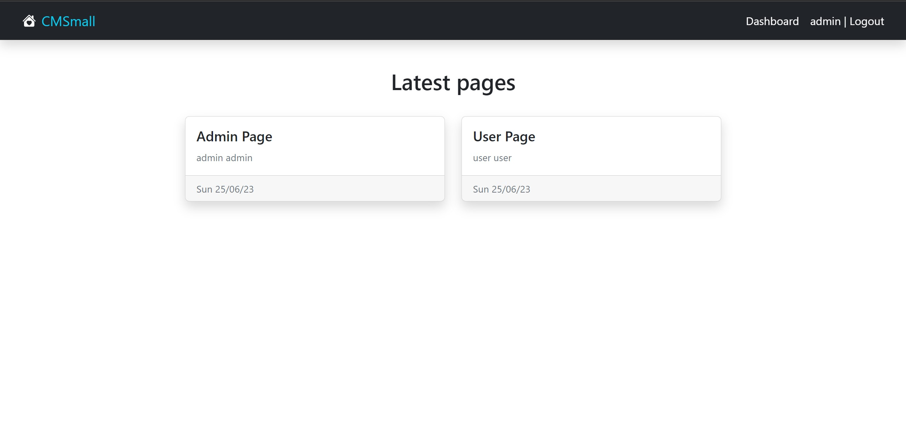
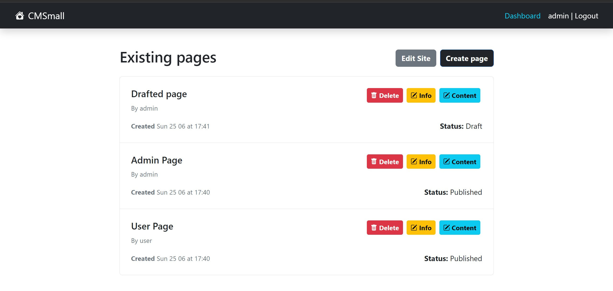
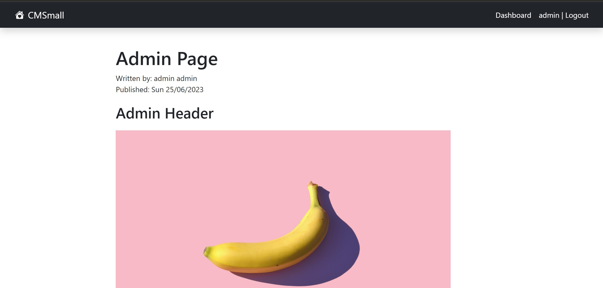
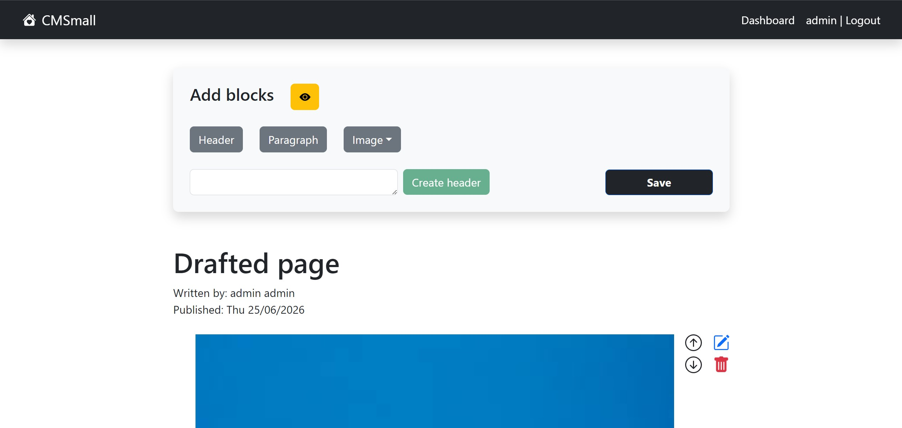
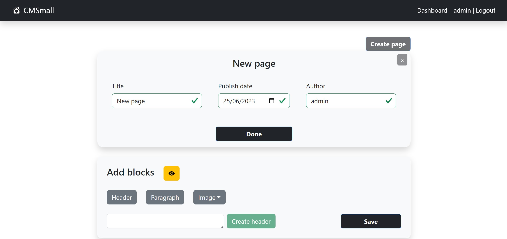

## Example Screenshot








# Server side

## API Server
## Transfer objects
UserResponse
```json
 {
    "data": {
        "id"
        "role"
        "username"
        "firstName"
        "lastName"
    }
}
```

PagesResponse 
```json
{
    "data": [{
            "id": 211,
            "title": "Drafted page",
            "author": {
                "id": 1,
                "role": "ADMIN",
                "username": "admin",
                "firstName": "admin",
                "lastName": "admin"
            },
            "publishedAt": "2026-06-25 00:00:00",
            "createdAt": "2023-06-25 17:41:13",
            "status": "Draft"
        }]
```

CreatePageResponse: 
```json {
    "data": {
        "info": {
            "id": 212,
            "title": "New page",
            "author": {
                "id": 1,
                "role": "ADMIN",
                "username": "admin",
                "firstName": "admin",
                "lastName": "admin"
            },
            "publishedAt": "2023-06-25 00:00:00",
            "createdAt": "2023-06-25 17:50:22",
            "status": "Published"
        },
        "blocks": [
            {
                "id": 520,
                "type": "paragraph",
                "order": 0,
                "content": "123"
            },
            {
                "id": 521,
                "type": "header",
                "order": 1,
                "content": "123"
            }
        ]
    }
}
```
CreatePageRequest
```json {
   "page":{
      "info":{
         "isSet":true,
         "title":"New page",
         "author":"admin",
         "publishedAt":"2023-06-25"
      },
      "blocks":[
         {
            "displayId":1,
            "content":"234",
            "order":0,
            "type":"paragraph"
         },
         {
            "displayId":0,
            "content":"234",
            "order":1,
            "type":"header"
         }
      ]
   }
}
```
BlocksResponse: 
```json {
    "data": [
        {
            "id": 517,
            "type": "img",
            "order": 0,
            "content": "blu.jpg"
        },
        {
            "id": 518,
            "type": "header",
            "order": 1,
            "content": "Drafted page header"
        },
        {
            "id": 519,
            "type": "paragraph",
            "order": 2,
            "content": "Lorem ipsum dolor sit amet"
        }
    ]
}
```

UpdateBlocksRequest
```json 
[
   {
      "id":518,
      "type":"header",
      "order":0,
      "content":"Drafted page header",
      "displayId":518
   },
   {
      "id":517,
      "type":"img",
      "order":1,
      "content":"blu.jpg",
      "displayId":517
   },
]
```

### Auth routes
- POST `api/auth/login`
  - request body: {username, password}
  - response body content: `UserResponse`
  
- POST `/api/auth/logout`
  - response body content: `"Logged out"`
- GET `/api/auth/session`
  - response body content: `UserResponse`

### Pages routes
- GET `api/pages/`
  - response body content: `PagesResponse`
- POST `/api/pages/`
  - request body: `CreatePageRequest`
  - response body content: `CreatePageResponse`
- GET `/api/pages/:id`
  - request parameters: The page to get ID
  - response body content: `BlocksResponse`
- DELETE `/api/pages/:id`
  - request parameters: The page to delete ID 
  - response body content: {data: true}
- PATCH `/api/pages/`
  - request body content: `UpdatePageRequest`
  - response body content: `PageResponse`

### Blocks routes
- GET `/api/blocks/:pageId`
  - request parameters and request body content: The page containing the blocks ID
  - response body content: `BlocksResponse`
- PUT `/api/blocks/:pageId`
  - request parameters and request body content: The page containing the blocks ID, `UpdateBlocksRequest`
  - response body content: `BlocksResponse`


## Database Tables

- Table `Users` - contains users and their account informations: (id, username, firstName, lastName, password, salt, role)

- Table `Pages` - contains Pages informations: (id, title, author [FK Users], publishedAt, createdAt, status) 

- Table `Blocks` - contains Blocks informations: (id, pageId [FK Pages], type, block_order, content) 

# Client side


## React Client Application Routes

- Route `/`: Layout with index Home
- Route `/pages/:pageId`: Displays the page related to pageId and its content 
- Route `/dashboard`: Displays the list of pages and related actions (delete a page, update a page, view page, edit a page)
- Route `/dashboard/create`: To create a page, displays a form related to page informations and a block action bar to create and modify the page content
- Route `/dashboard/edit`: To edit a page, displays the page content and a block action bar to create and modify the page content


## Main React Components

- `CreatePage` (in `/pages`): Handle the creation of a page and its content
- `EditPage` (in `/pages`): Handle the update of a page blocks
- `Page` (in `/pages`): Display a page and its content
- `Dashboard` (in `/dashboard`): Handles top level actions on pages (delete, update info, show), contains links to Create and Edit pages
- `EditBlockList` (in `/pages/blocks`): Wraps Form Controls to edit blocks content and its order
- `BlocksBar` (in `/pages/blocks`): Handles the creation of new blocks 

(only _main_ components, minor ones may be skipped)


## Users Credentials

- admin, password
- user, password
